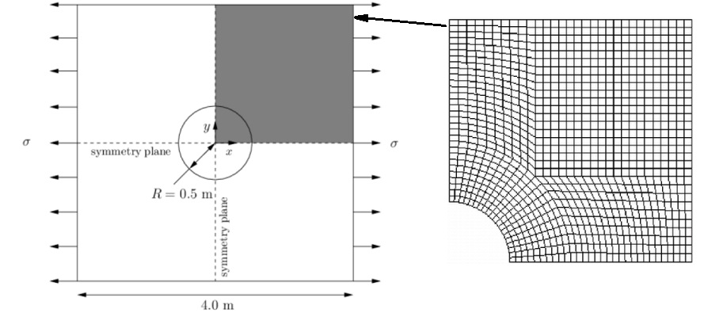

# Using Convolutional Neural Networks to Accelerate Stress Analysis
Finite element, finite difference, and finite volume methods are among the most popular methods for solving partial differential equations governing many problems in engineering and material sciences. Calculating stress distribution in physical systems requires extensive computational resources through implementing software packages, and can take hours, days or weeks to execute for complex geometries. More importantly, the simulation need to be redone from scratch to apply new boundary conditions or material properties during the design process. These drawbacks of conventional stress analysis methods limit opportunities for interactive design. Recent advances in deep learning algorithms demonstrate that by approperiate selection of models and with the cost of minor additional computational errors we can significantly accelerate the stress analysis methods. In this note, I discuss the feasibility of complementing finite volume method with deep learning through providing a case study. The outcomes show that using Convolutional Neural Network method, we can reduce the computational time by 82%, while obtaining the results with 94% accuracy.

## Introduction
Recent studies have shown the possibility of incorporating machine learning (ML) and deep learning methods to obtain faster and less costly solutions for stress analysis problems. Nguyen-Thien and Tran-Cong [1] showed the capability of Artificial Neural Network (ANN) methods in implementing numerical approximation of functions of several variables and their first and second order partial derivatives. Martin-Guerrerohas et al. [2] demonstrated the feasibility of using ANN to model the deformations produced in human soft tissue with high accuracy. They used finite element method (FEM) to produce the datasets of deformation to feed the ML algorithm. Kononenko and Kononenko [3] as well as Javadi et al. [4] integrated neural networks with finite element method to analyse stress distribution simple one dimensional (1D) problems. These studies either used a small dataset for training their model, or provided simple 1D problems as test cases. In this study I show the feasibility of using neural networks for faciliating stress analysis problems on more complex, two dimensional (2D) problems.
Here, I use finite volume method (FVM) to calculate the stress distribution on a 2 plate with a circular hole for various forces applied. I use the generated dataset of results to train a 3 layer Convolutional Neural Netwrok (CNN) model and predict stress distribution over the plate for uncalculated forces. The results will be compared to the test data to calculate the accuracy of the model.

## Methodology
### Geometry
The 2D flat plate with hole that I use in this study as test case is illustrated in Figure 1. The simulations were done on a quarter of the plate, as the problem is symmetric. The forces were applied on the right and left edges. The grid was generated non-uniformly with finer numerical cells closer to the boundaries, forming a total of 1071 numerical cells. \
\
 \
_          Fig.1. Schematic illustration of the geometry._\

### Numerical Simulation
The numerical simulations were conducted using OpenFOAM 2.3 software package. The FVM method was employed for calculating partial differential equations. Simulations were conducted on a range of applied stresses (i.e. 0, 1000, 2000, … 100,000(Pa)) resulting in 101 dataset (each 1071 rows). The stress distribution as a result of applied stress of 1000Pa is shown in Figure 2.\
\
 \
_          Fig.2. A sample of the simulation results (S=1000Pa)._\
\
ads

